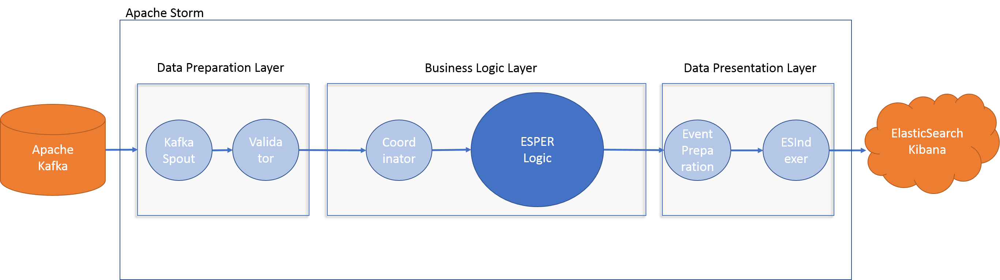

# CEP Sensor Analytics

CEP Sensor Analytics is a project based on Apache Storm and Esper Framework. 
The engine reads input events and runs custom queries.


# Requirements
  - [Oracle JDK 1.8.X](http://www.oracle.com/technetwork/java/javase/downloads/jdk8-downloads-2133151.html)
  - [Apache Storm 1.0.1](https://archive.apache.org/dist/storm/apache-storm-1.0.1/)
  - [Apache Kafka kafka_2.11-0.9.0.1](https://archive.apache.org/dist/kafka/0.9.0.1/kafka_2.11-0.9.0.1.tgz)
  - [ElasticSearch 5.2.2](https://www.elastic.co/downloads/past-releases/elasticsearch-5-2-2)
  - [Kibana 5.2.2](https://www.elastic.co/downloads/past-releases/kibana-5-2-2)
    
# Installation
 1. Download And Install all Requirements.
 2. Replace the following:  
    * `/cep-sensor-analytics/src/kafka-storm-configs/server.properties` in kafka config folder.  
    * `/cep-sensor-analytics/src/kafka-storm-configs/storm.yaml` in storm config folder.   
 3. Update `/cep-sensor-analytics/src/scripts/env.sh` with proper paths in your enviroment.  

# Execution
1. Set current path as kafka config path:  
  `cd /cep-sensor-analytics/src/kafka-storm-configs/`
2. Start Kafka:   
  `./start_kafka.sh`
3. Start Storm:  
  `./start_storm.sh`
4. Prepare topics:  
  `./prepare_topics.sh`
5. Submit Topology:  
  `./submit_topology_(local|distr).sh`
6. Start Kibana/ES:  
  `./submit_es_kibana.sh`
7. Create Indicies if they don't exist:    
 ```
  curl -XPUT 'http://localhost:9200/es_avgpersons'  -d @es_avgpersons.json
  curl -XPUT 'http://localhost:9200/es_avgvelocity' -d @es_avgvelocity.json
  curl -XPUT 'http://localhost:9200/es_avgwaiting'  -d @es_avgwaiting.json
  curl -XPUT 'http://localhost:9200/es_roomtraffic' -d @es_roomtraffic.json
  curl -XPUT 'http://localhost:9200/es_recurring' -d @es_recurring.json
  ```
8. Generate Data:  
  `./data_generator.py -s #SECONDS(>60) |$KAFKA_HOME/bin/kafka-console-producer.sh --topic CSVINPUT --broker-list localhost:9092`


Please note that a single machine needs memory (8GB+) for all these!
